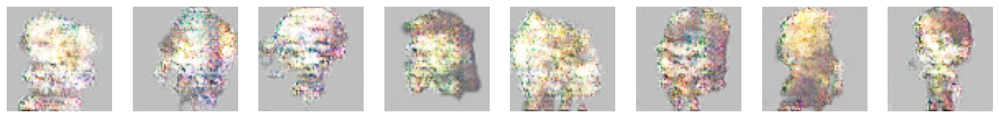
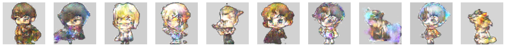

# DCGAN
This repository contains my implementation of a Deep Convolutional 
Generative Adversarial Network (DCGAN), a type of neural network 
architecture under the Generative Adversarial Networks (GANs) umbrella. 
GANs are known for their adversarial nature, leading to inherent 
instability during training. Recent research has made strides in 
balancing this adversarial relationship, and this project explores 
those techniques, aiming to enhance stability and performance further.

# Data Set
The dataset comprises sprites sourced from various online platforms, 
including MapleStory, free game asset forums, and Google Images. 
Each sprite was manually cleaned and preprocessed to fit the input 
dimensions of 64x64x4. Due to copyright restrictions, the dataset 
itself cannot be shared.

# Implementation
The project builds upon a basic DCGAN framework provided by PyTorch 
[1].

Additional modifications include the introduction of a linear layer, 
cosine annealing, gradient clipping, and mixed precision training. 
Further advances were inspired by existing literature focusing on 
DCGAN quality and stability improvements. The first point was an 
original idea, and thus no reference, however I do not claim to be the 
first to implement it.

1. **Dynamic Adversarial Training Frequency** - The training frequency
   of either adversary is the number of times the adversary is trained
   per batch. We use the delta loss of the previous batch to compute
   the number of times the adversary should be trained on the current
   batch. The idea is, since the Generator's loss and the 
   Discriminator's loss should tend towards 0 and 0.5 respectively,
   we can use delta loss to adapt the number of times an adversary is
   trained based on the direction of and how far they deviate from 
   their objective loss.
2. **Mini Batch Discrimination** [2] - Mini batch discrimination 
   addresses one of the sources of model 
   collapse and is the instance where the generator learns the 
   effectiveness of a single data point that is able to successfully
   fool the discriminator. When the generator continuously samples 
   from this same point, the entire adversarial relationship tends 
   towards it which results in a loss of diversity and uniqueness in 
   the generators outputs. This happens because gradient descent is 
   not aware of repeated or identical samples. Mini batch 
   discrimination addresses this instance by allowing the 
   discriminator to look at multiple data samples at once, rather than
   one sample at a time. 
3. **One-sided Label Smoothing** [2] - One-sided label smoothing is a 
   technique where the target labels are modified to reduce 
   overconfidence and improve generalization. By doing this, the model 
   learns to be less confident about its predictions, which can lead 
   to better generalization 

## Results
All of the following were taken at 300 epochs. 

After implementing the basic Pytorch DCGAN. 
 

After implementing common techniques mentioned. 
 

After implmenting Mini Batch Discrimination, and One-sided Label 
Smoothing. 
 

After implementing Dynamic Adversarial Training Frequency and tuning
noise size. 
 

## Future Work
In future work, I wish to experiment with the following promising 
results in hopes of further improving stability. I also plan to find
optimal hyper parameters.

1. **Feature Matching**
2. **Self Attention**
3. **Ensembles** [4] - Specifically Enhancement GANs 
4. **Multi-head Discriminator** [3]

# References
1. https://pytorch.org/tutorials/beginner/dcgan_faces_tutorial.html
2. Salimans, Tim, et al. "Improved techniques for training gans." Advances in neural information processing systems 29 (2016).
3. C. Hardy, E. Le Merrer and B. Sericola, "MD-GAN: Multi-Discriminator Generative Adversarial Networks for Distributed Datasets," 2019 IEEE International Parallel and Distributed Processing Symposium (IPDPS), Rio de Janeiro, Brazil, 2019, pp. 866-877, doi: 10.1109/IPDPS.2019.00095.
4. Jiang, Yifan, Shiyu Chang, and Zhangyang Wang. "Transgan: Two transformers can make one strong gan." arXiv preprint arXiv:2102.07074 1.3 (2021).
5. Salimans, Tim, et al. "Improved techniques for training gans." Advances in neural information processing systems 29 (2016).