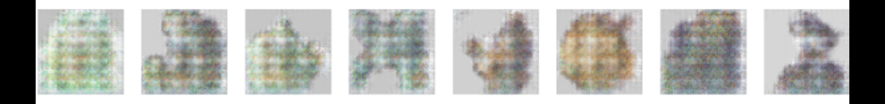
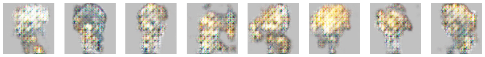

# DCGAN
This is my implementation of a Deep Convolutional Generative 
Adversarial Network (DCGAN). GANs are inherently unstable due to the 
adversarial nature of the generator and discriminator, however efforts
in related research have focused on and improved the balance between the 
adversarial relationship. My interest with this project is to study 
these techniques and to experiment with ways of improving this balance. 

# Data Set
The data set for this model is a combination of sprites from various
online sources such as MapleStory, free game asset forums, and results
from google images. The data was manually cleaned and fed into the 
network as a 64x64x4 image. Due to some of the material being 
copyrighted by certain entities, I cannot provide the data set.

# Implementation
The base for this project was the example implementation of a vanilla 
DCGAN by PyTorch[1]. 
In addition, I added a linear layer, cosine annealing, gradient
clipping, mixed precision training, and a few other things to assist 
the model to stabalize its losses. Further advancements were fueled by 
existing papers whose focus was to also improving the quality and 
stability of DCGANs. [1] was an original idea, however I do not claim
to be the first to think of it.

1. **Dynamic Adversarial Training Frequency** - The training frequency
   of either adversary is the number of times the adversary is trained
   per batch. We use the delta loss of the previous batch to compute
   the number of times the adversary should be trained on the current
   batch. The idea is, since the Generator's loss and the 
   Discriminator's loss should tend towards 0 and 0.5 respectively,
   we can use delta loss to adapt the number of times an adversary is
   trained based on the direction of and how far they deviate from 
   their objective loss.
2. **Mini Batch Discrimination** [2] - Mini batch discrimination 
   addresses one of the sources of model 
   collapse and is the instance where the generator learns the 
   effectiveness of a single data point that is able to successfully
   fool the discriminator. When the generator continuously samples 
   from this same point, the entire adversarial relationship tends 
   towards it which results in a loss of diversity and uniqueness in 
   the generators outputs. This happens because gradient descent is 
   not aware of repeated or identical samples. Mini batch 
   discrimination addresses this instance by allowing the 
   discriminator to look at multiple data samples at once, rather than
   one sample at a time. 
3. **One-sided Label Smoothing** [2] - One-sided label smoothing is a 
   technique where the target labels are modified to reduce 
   overconfidence and improve generalization. By doing this, the model 
   learns to be less confident about its predictions, which can lead 
   to better generalization 
4. 

## Results
After implementing the basic Pytorch DCGAN. 
  
After implementing common techniques mentioned. 

After implmenting Dynamic Adversarial Training Frequency, Mini Batch 
Discrimination, One-sided Label Smoothing
## Future Work
In future work, I wish to experiment with the following promising 
results in hopes of further improving stability.

1. **Feature Matching**
2. **Self Attention**
3. **Ensembles** [4] - Specifically Enhancement GANs 
4. **Multi-head Discriminator** [3]

# References
1. https://pytorch.org/tutorials/beginner/dcgan_faces_tutorial.html
2. Salimans, Tim, et al. "Improved techniques for training gans." Advances in neural information processing systems 29 (2016).
3. C. Hardy, E. Le Merrer and B. Sericola, "MD-GAN: Multi-Discriminator Generative Adversarial Networks for Distributed Datasets," 2019 IEEE International Parallel and Distributed Processing Symposium (IPDPS), Rio de Janeiro, Brazil, 2019, pp. 866-877, doi: 10.1109/IPDPS.2019.00095.
4. Jiang, Yifan, Shiyu Chang, and Zhangyang Wang. "Transgan: Two transformers can make one strong gan." arXiv preprint arXiv:2102.07074 1.3 (2021).
5. Salimans, Tim, et al. "Improved techniques for training gans." Advances in neural information processing systems 29 (2016).